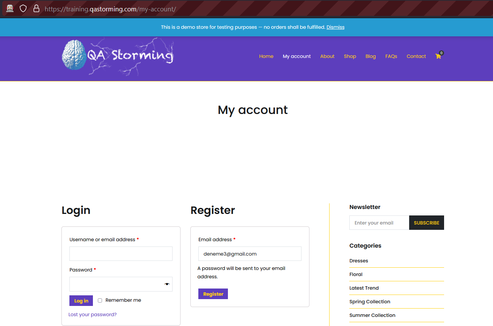
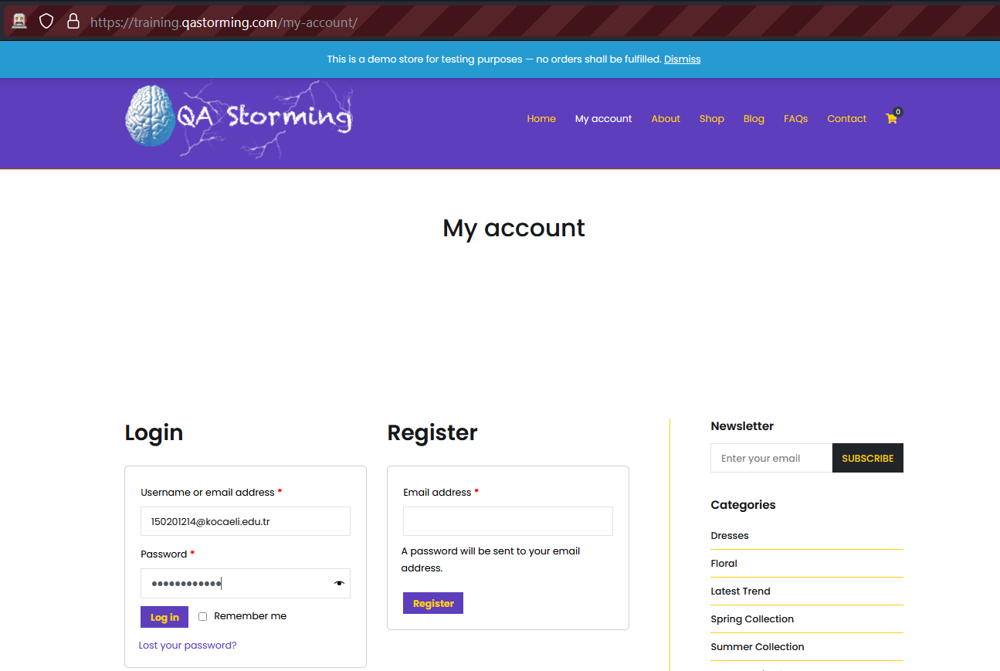
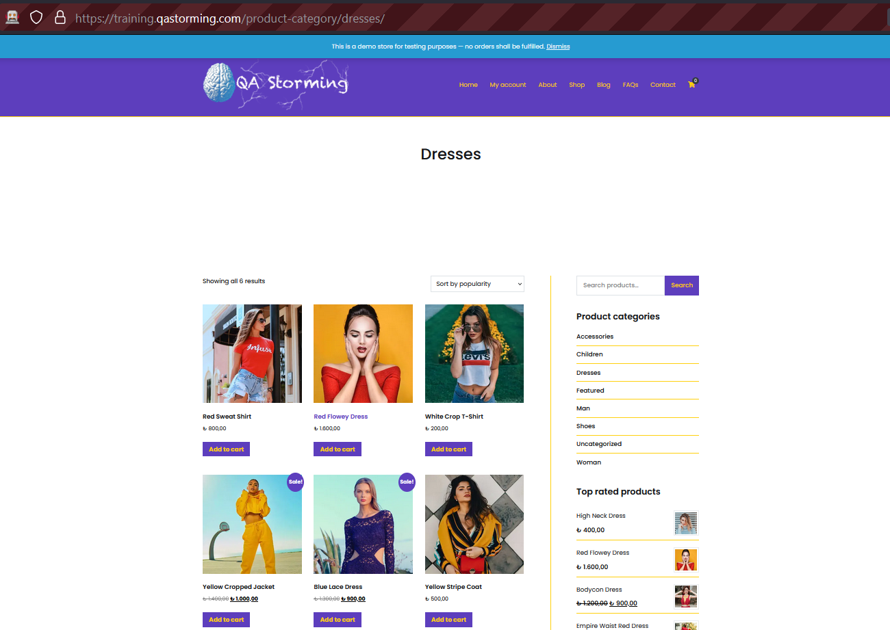
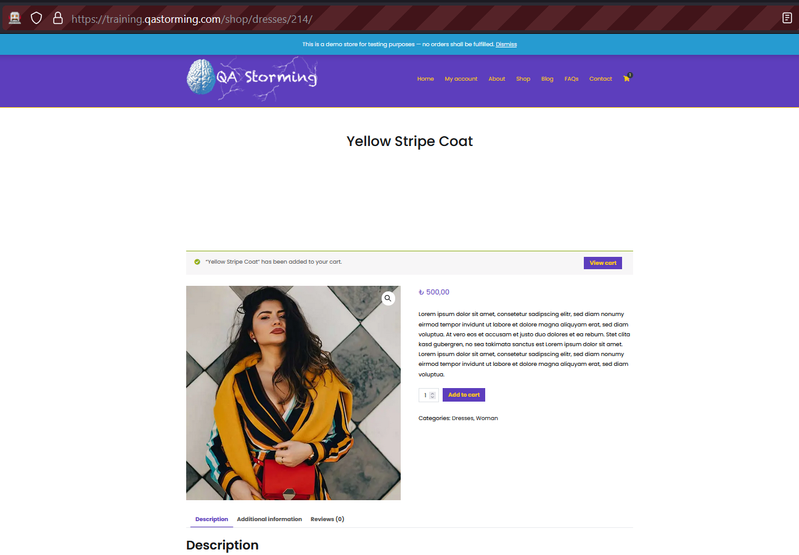
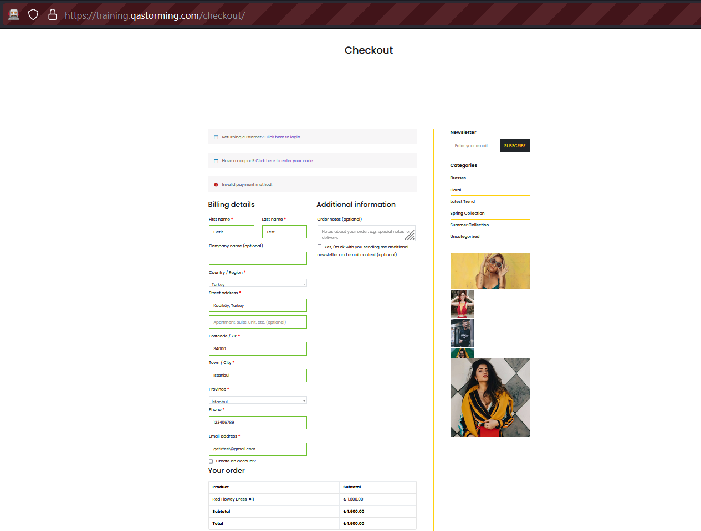
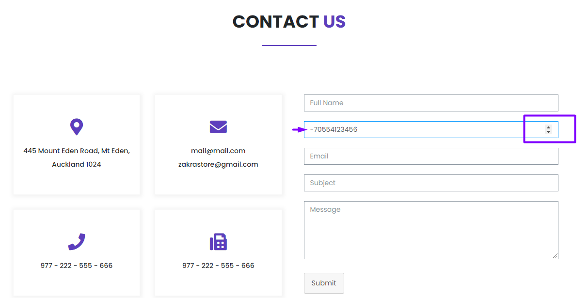

# Getir: Selenium Case Example

Browser: Mozilla Firefox,  Web Driver: Firefox driver,  Language: Java

## Case 1: Register 
User opens 'My Account Page', after enters mail adress and clicks register button. Finally user completes registration.

## Case 2: Account Details 
User opens 'My Account Page' and sig in system. User opens 'Account Details Page' after fills account details adn changes password.

 

 

## Case 3: Complete Order
User opens 'Shop Page' and 'Dresses Category'. User selects a product and opens details of product, after adds cart and controls viewcart. Finally user proceeds to checkout and fills all mandatory fills and clicks place order button.

## Some Bug Examples

### Bug 1: Ürünler sayfasındaki ücrete göre sıralama seçenekleri seçildiğinde ürünler random sıralanmaktadır.

Bug Url: https://training.qastorming.com/shop/

Senaryo Adımları: Shop sekmesine tıklanır ve products sayfası açılır. Products sayfasında listelenen ürünlerin sağ üst köşesinde bulunan dorpdown menüden 'Sort by price:low to high' veya 'Sort by price:high to low' seçeneklerinden biri seçilir.

Senaryo Sonucu: Ürünler fiyatlarına göre random sıralanmaktadır.

Beklenen Sonuç: Ürünlerin seçilmiş olan fiyat sıralama seçeneğine göre sıralanması gerekmektedir.

  
 

### Bug 2: Contact Us bölümündeki iletişim forumunda bulunan 'Phone No' alanında negatif numara oluşturulmaktadır.

Bug Url: https://training.qastorming.com/contact/

Senaryo Adımları: Contact sayfasına geçiş yapılır ve 'Contact Us' bölümündeki 'Phone No' alanının sağ köşesindeki aşağı oku kullanılır ve negatif rakam/sayı üretilir. Daha sonra telefon numarası eklenir.

Senaryo Sonucu: Negatif bir telefon numarsı oluşmaktadır.

Beklenen Sonuç: Aşağı ok kullanıldığında sıfırdan sonra küçültme işlemi yapılmamalı ve negatif telefon numarası oluşturulmamalıdır.

  
 

